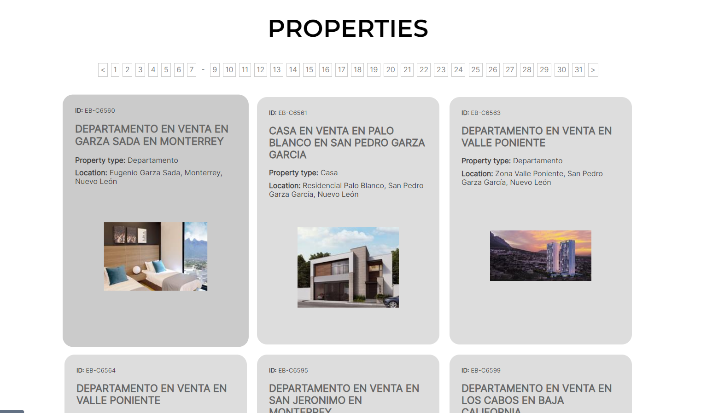
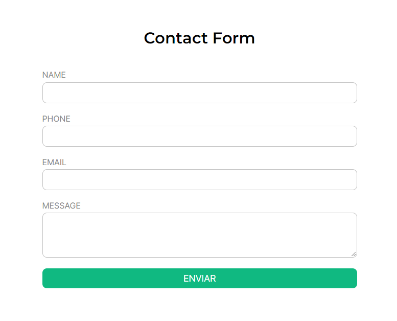

# Easy Broker Client

Welcome to Easy Broker Client a website connected to EasyBroker API with all their published properties.

## Instructions

- Clone this repo on your local machine.
- Run `bundle install`
- Start the server `rails s`

## Testing

- Run `rspec`

Things you may want to cover:

## About the website

### Properties list page

In this page you can see all the properties published, you can only see 15 properties per page. You can go to the page number you want by clicking on the number of the page you want in the pagination 

Each card includes this information of the property:
- Public ID
- Title
- Property type
- Location
- Image

If you want to see more information about the property, you can click on the card and see the property page.

### Properties list page

In this page you can see more information about the property.

There is also a contact form to send a message if you want to be a lead for the property.

## Notes

- Due to I worked with a third party service (EasyBroker API), I didn´t have models to work with, so I have to use POROS (Plain Old Ruby Objects), it was a solution that I found in order to use OOP. 

- I decided to use only a class for services because there was only 2 entities (property and contact), but it could be improved by creating a class for each one.

- It was a litle challenge, but I create my own pagination to take advantage of that EasyBroker API gives the list of properties per page, I'm not sure where I can put this code, it's one area I think is not clean. I could also improve the pagination so that it only shows a certain amount of pages and not all.

- It is really interesting to work in test with a third party service, you have to take in count a lot of drawbacks, I like how VCR gem helps to solve some of them.
